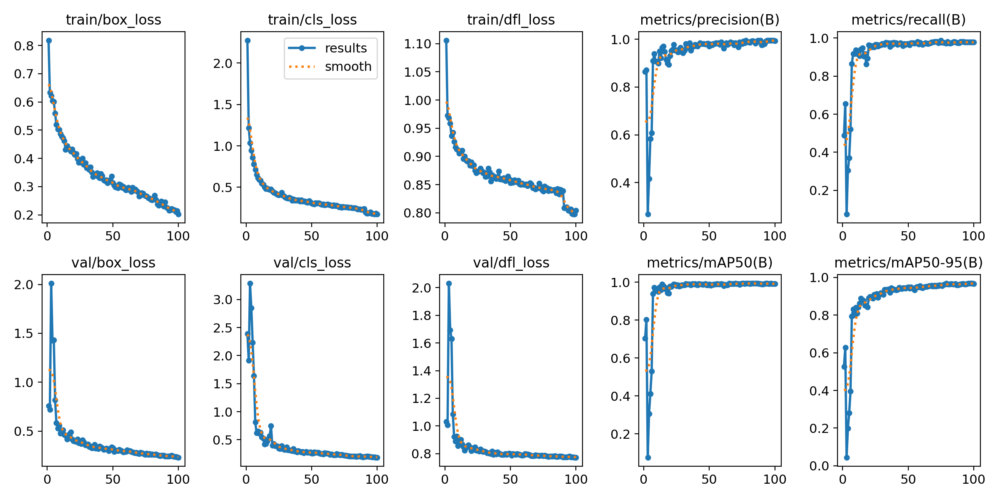

# Fire detection with fine tuned YOLOv11

- [Fire detection with fine tuned YOLOv11](#fire-detection-with-fine-tuned-yolov11)
  - [Data](#data)
    - [Preprocessing](#preprocessing)
  - [Model](#model)
  - [Fine Tuning](#fine-tuning)
    - [Run summary:](#run-summary)
    - [Curves](#curves)
  - [Detections](#detections)
  - [Dependencies](#dependencies)
  - [Project Setup](#project-setup)
  - [Limitations](#limitations)
  - [Conclusions](#conclusions)
  - [Acknowledgements](#acknowledgements)

## Data

The [Fire Dataset](https://universe.roboflow.com/hongyu-lin/fire-zecc7/dataset/2) is used to fine tune the model. The dataset contains **751** total images with a **training-validation-test** splitting of 526, 150 and 75 images respectively.

### Preprocessing

- Auto-Orient: Applied
- Resize: Stretch to 640x640

## Model

The `yolo11n` version of the model is used to fine-tune on the dataset. The model was trained for **100** epochs with batch size **16**.

_Note_: The .ipy notebook is not uploaded due to privacy issues.

## Fine Tuning

**YOLO11n summary (fused)**: 238 layers, 2,582,347 parameters, 0 gradients, 6.3 GFLOPs

### Run summary:

| Parameter / Metric      | Value   |
| ----------------------- | ------- |
| lr/pg0                  | 4e-05   |
| lr/pg1                  | 4e-05   |
| lr/pg2                  | 4e-05   |
| metrics/mAP50(B)        | 0.99359 |
| metrics/mAP50-95(B)     | 0.96755 |
| metrics/precision(B)    | 0.99529 |
| metrics/recall(B)       | 0.97778 |
| model/GFLOPs            | 6.441   |
| model/parameters        | 2590035 |
| model/speed_PyTorch(ms) | 2.36    |
| train/box_loss          | 0.20238 |
| train/cls_loss          | 0.17491 |
| train/dfl_loss          | 0.80457 |
| val/box_loss            | 0.23068 |
| val/cls_loss            | 0.18552 |
| val/dfl_loss            | 0.77294 |

### Curves



## Detections

<div style="display: flex; flex-direction: column; align-items: center;">
    <div>
        
        
    </div>
    <div>
        
        
    </div>
    <div>
        
        
    </div>
    <div style="display: flex;">
      <div>
        
        
      </div>
      <div>
        
        
      </div>
    </div>
    <div>
    </div>
    <div style="display: flex;">
      <div>
        
        
      </div>
      <div>
        
        
      </div>
    </div>
</div>

## Dependencies
- python 3.x
- opencv_contrib_python
- opencv_python
- ultralytics

## Project Setup

1. Make a virtual environment using the following command:

    ```bash
    python3 -m venv myenv
    ```

    Replace `myenv` with the name you want for your virtual environment. This will create a folder named myenv in your current directory containing the virtual environment files.

2. Activate the virtual environment:

    ```bash
    source myenv/bin/activate
    ```

    Remember to replace `myenv` with the actual name of the environment created in the previous step.

3. Clone the repository:

    ```bash
    git clone https://github.com/bhaskrr/fire-detection-using-yolov11.git
    ```

4. Navigate to the root directory of the project:

    ```bash
    cd path/to/the/project
    ```

5. Install dependencies:
    ```bash
    pip install -r requirements.txt
    ```

## Limitations

The model can be further improved with a more diverse dataset and more classes to detect, e.g. smoke.

## Conclusions

This project demonstrates how a fine-tuned YOLOv11 model can be used for detecting fire.

Here are a few use cases for this project:

1. Wildfire Monitoring: Early detection of wildfires in forests or remote areas through real-time video feeds or drone footage, helping in quick response and minimizing damage.

2. Smart Security Systems: Integration with surveillance cameras in residential, commercial, or industrial properties to detect fire, triggering alarms or notifications automatically.

3. Industrial Safety: Monitoring areas in factories or warehouses where fire hazards are present, especially around chemical storage or flammable materials.

4. Autonomous Firefighting Drones: Fire detection systems could guide drones to automatically detect and respond to fires in hazardous or hard-to-reach areas.

5. Transport Safety: Real-time monitoring in public transport systems (trains, buses, or even airplanes) to detect fire risks and prevent accidents.

6. Fire Safety in Smart Homes: Integration into smart home systems to provide immediate alerts and notifications to homeowners and emergency services when fire is detected.

## Acknowledgements

The images used to test the model are taken from [kaggle](https://www.kaggle.com/).
